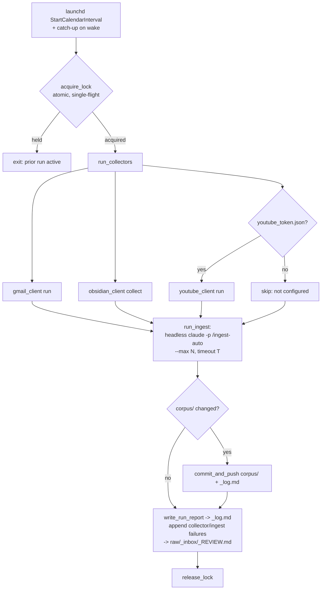
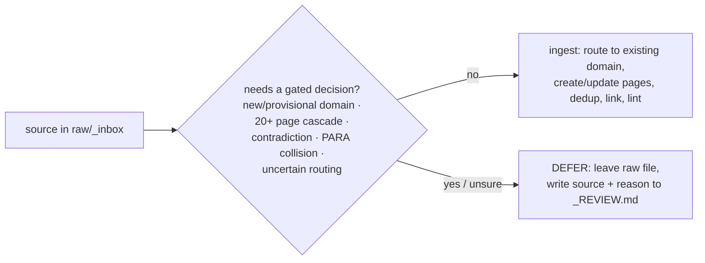

# Scheduled Collection & Safe-Subset Ingestion — Implementation Plan

> **For agentic workers:** decisions-and-scope plan (ce-plan output). Each implementation unit lists repo-relative file paths, a test file path where feature-bearing, and enumerated test scenarios. Execute with `superpowers:subagent-driven-development` (one unit per subagent, spec-then-quality review between units), as with the collectors and `/query`. **U1 is a throwaway spike that gates U3–U7 — do not build the orchestration until U1's findings are in.**

**Goal:** A single daily, local (MacBook/launchd) job that chains *collect → safe-subset agentic auto-ingest → commit & push → repo report*, deferring every gated decision to a review queue, so the corpus drains its backlog unattended.

**Architecture:** A Python orchestrator (`bin/scheduled_run.py`, pytest-covered, mirrors the collector split) acquires an atomic lock, runs the three collector CLIs with isolated per-channel failure, invokes a **non-interactive `claude` headless run** of a new `/ingest-auto` skill (bounded by max-batch + timeout) that performs only ungated v0.6 Branch-A ingest and writes gated/failed items to a gitignored review queue, then commits & pushes the `corpus/` changes and appends a run summary to `corpus/_log.md`. launchd fires it daily and coalesces missed runs on wake. A `SessionStart` hook surfaces the pending-review count.

**Tech stack:** Python 3 stdlib (`subprocess`, `os`/atomic lock, `argparse`) — no new deps; the existing collector CLIs (`bin/gmail_client.py run`, `bin/youtube_client.py run`, `bin/obsidian_client.py collect`); the `claude` CLI in headless `-p` mode; launchd (`StartCalendarInterval`); git. No OAuth or new tokens (reuses the collectors' existing tokens + `.env`).

---

## Problem frame & scope

The collection layer and the v0.6 ingest pipeline are built but run **manually, in-session**. The corpus only advances when the user triggers it; the user is frequently away from the Mac. This feature automates the whole chain locally, advancing the `STRATEGY.md` **Backlog drain rate** metric from a sit-down-dependent number to a daily one, while keeping a hard guardrail: **no gated decision (new domain, collision, contradiction, oversized cascade) ever lands unattended** — those route to a review queue. Because the user chose auto-commit **and** auto-push (no human checkpoint before the remote), the gating boundary is the sole pre-remote guardrail, so the agent **biases to defer when uncertain** (see origin: docs/brainstorms/2026-06-12-scheduled-automation-requirements.md).

**In scope:** the full brainstorm — daily launchd job, the three collectors (youtube dormant until its token exists), bounded safe-subset agentic ingest, gitignored review queue, auto-commit+push, repo run-report, single-flight lock, asleep catch-up, isolated collector failure, next-session pending-count surfacing.

**Out of scope (carried from origin):** cloud/remote or multi-machine execution & sync; scheduling the `/query` web-intake; automating the *gated* decisions themselves; email/macOS notification channels; sub-daily or event-driven cadence.

---

## Requirements traceability

| Req (origin) | Where satisfied |
|---|---|
| **R1** daily launchd job, no open session | U6 (launchd plist) + U3 (orchestrator entrypoint) |
| **R2** single-flight lock | U2 (`acquire_lock`) |
| **R3** asleep → one catch-up run on wake | U6 (`StartCalendarInterval` semantics) |
| **R4** run email + obsidian collectors; isolated per-channel failure | U3 (`run_collectors`) |
| **R5** youtube no-op until token exists; auto-activates | U3 (token-presence gate on `bin/youtube_token.json`) |
| **R6** non-interactive ungated v0.6 ingest (route existing, create/update, dedup, link, lint) | U1 (spike) → U4 (`/ingest-auto` skill) + U3 (`run_ingest`) |
| **R7** defer gated actions (new/provisional domain, 20+ cascade, contradiction, PARA collision); bias-to-defer | U4 (skill discipline) — the safety core |
| **R8** bounded: max batch + wall-clock timeout; overflow carried forward | U3 (`run_ingest` bounds) + U4 (skill respects `--max`) |
| **R9** auto-commit + auto-push corpus changes + log, clear revertable message | U5 (`commit_and_push`) |
| **R10** gated/failed items + review queue stay local/gitignored | U2 (`.gitignore`) + U4/U3 (write queue under `raw/`) |
| **R11** run summary appended to `corpus/_log.md` (counts per channel) | U3 (`write_run_report`) |
| **R12** gitignored review queue naming each deferred source + why | U4 (skill writes it) + U3 (failures appended) |
| **R13** next interactive session surfaces pending count | U7 (`SessionStart` hook) |

---

## Key technical decisions

1. **Spike before build (U1).** Headless `claude` driving the agentic v0.6 pipeline is the only unproven mechanism; everything else is conventional scripting. `claude` is not even on the default shell PATH, and launchd runs in a minimal environment — so U1 also pins down the binary path, the permission mode that allows unattended edits/writes without prompts, the output format to capture a result, and whether the safe-subset gates actually hold non-interactively. U1 is throwaway (findings → the other units); if it shows headless agentic ingest is unreliable, we fall back to **collect-only automation + notify** (the brainstorm's option B) without having built the orchestration around a broken core.
2. **Orchestrator in Python, not bash.** `bin/scheduled_run.py` gives an atomic lock (macOS has no `flock`), testable units (pytest + mocked `subprocess`/git), and consistency with the collector pattern (deterministic core + thin I/O). The launchd plist calls `python3 bin/scheduled_run.py run`.
3. **Safe-subset enforced by a dedicated `/ingest-auto` skill**, invoked headless, rather than a long inline prompt. The discipline (ungated-only · defer gated to the review queue · bias-to-defer-when-uncertain · respect `--max`) lives in versioned skill prose next to `collect-*`, reviewable and diffable.
4. **Absolute binary paths + explicit env in the orchestrator.** launchd jobs do not inherit the user's interactive shell PATH. The orchestrator resolves `claude`, `python3`, `git` to absolute paths (discovered in U1) and runs with an explicit working directory and environment (loads `.env` for `ANTHROPIC_API_KEY` the way `bin/rank_links.py::load_env` already does).
5. **Scoped git add.** `commit_and_push` stages only `corpus/` (the committed product) — never `raw/` (gitignored personal data). Message is a clear `chore(auto-ingest): …` with per-channel counts; push to the existing remote. Revertable; repo is private.
6. **Review queue = gitignored `raw/_inbox/_REVIEW.md`.** Already covered by the `raw/_inbox/*` gitignore rule; the skill rewrites it each run with deferred sources + reasons. Failures from collectors/ingest are appended by the orchestrator.

---

## High-Level Technical Design

Daily chain (launchd → orchestrator), with the lock as a single-flight gate and isolated failure per step:

Safe-subset boundary inside `/ingest-auto` (U4) — the sole pre-remote guardrail:

---

## Implementation units

### U1. Spike — headless agentic ingest feasibility (throwaway)

**Goal:** Prove a non-interactive `claude` run can execute the v0.6 Branch-A ingest over a small `raw/_inbox/` sample, honor the safe-subset gates, write a deferral to a review file, stay within a bound, and produce a capturable result — and record the exact invocation mechanics.
**Requirements:** R6, R7, R8 (de-risks them).
**Dependencies:** none (run first).
**Files:** none committed — findings are written into this plan's later units and a short note appended to the plan's "Sources & Research". (Optional scratch under a gitignored path; delete after.)
**Approach:** manually trial `claude -p "<ingest a 2–3 file sample under the safe-subset rules>"` variants. Determine and record: (a) absolute path to the `claude` binary and the minimal env/PATH it needs; (b) the permission mode that lets it edit/write files unattended without prompting; (c) the output/result format to capture for the run report; (d) whether it reliably refuses gated actions (seed the sample with one source that has no existing domain → expect a deferral, not a new domain); (e) a rough wall-clock for N sources to inform the U3 timeout/max defaults. Use throwaway/sample inputs; do not push anything.
**Execution note:** This is exploratory spike work, not test-first. Its output is knowledge, not code. **Gate:** if headless agentic ingest proves unreliable or unsafe, stop and surface the fallback (collect-only automation + notify) before building U3–U7.
**Test scenarios:** Test expectation: none — throwaway spike; success is documented findings (invocation string, permission mode, binary path, gate-honoring evidence, timing).
**Verification:** A written findings note covering (a)–(e) exists; a seeded gated source produced a deferral rather than an unattended new-domain write.

### U2. Orchestrator scaffold — atomic lock + gitignore

**Goal:** Create `bin/scheduled_run.py` with the single-flight lock and reserve the gitignored paths the run uses.
**Requirements:** R2, R10.
**Dependencies:** U1 (confirms the overall shape).
**Files:** Create `bin/scheduled_run.py`; Create `tests/test_scheduled_run.py`; Modify `.gitignore`.
**Approach:** `acquire_lock(lock_path)` / `release_lock` using an atomic primitive (e.g. `os.open(..., O_CREAT|O_EXCL)` or atomic `mkdir`) — no `flock` (absent on macOS). Lock file under a gitignored path (e.g. `raw/.scheduled_run.lock`). A held lock makes a new run exit cleanly (status `locked`), not block. Add `.gitignore` entries for the lock file and a run log file if used; confirm `raw/_inbox/_REVIEW.md` is already covered by `raw/_inbox/*` (it is — assert in a comment).
**Patterns to follow:** module shape of `bin/collect_email.py` (`#!/usr/bin/env python3`, `from __future__ import annotations`, `ROOT = Path(__file__).resolve().parent.parent`, JSON-line CLI).
**Test scenarios:**
- `acquire_lock` succeeds when no lock exists; creates the lock file.
- Second `acquire_lock` while held returns the locked sentinel / False and does not overwrite the existing lock.
- `release_lock` removes the lock; a subsequent `acquire_lock` succeeds again.
- `release_lock` on an absent lock is a no-op (no raise).
- Lock path resolves under a gitignored dir (assert it's within `raw/`).
**Verification:** Lock round-trips under `tmp_path`; full suite stays green.

### U3. Collector orchestration + bounded ingest invocation + run report

**Goal:** Run the three collectors with isolated failure, invoke the bounded headless ingest, and write the run report to `corpus/_log.md`.
**Requirements:** R1, R4, R5, R6, R8, R11.
**Dependencies:** U1, U2.
**Files:** Modify `bin/scheduled_run.py`; Modify `tests/test_scheduled_run.py`.
**Approach:**
- `run_collectors(...) -> dict`: invoke `gmail_client.py run` and `obsidian_client.py collect` via `subprocess` (absolute `python3`); wrap each in try/except so one channel's non-zero exit / exception is **recorded and skipped**, never aborting the others (mirrors the collectors' own per-item isolation). YouTube leg: only invoke `youtube_client.py run` when `bin/youtube_token.json` exists; otherwise record `youtube: not configured` (R5). Return per-channel `{collected, status}` tallies.
- `run_ingest(max_n, timeout_s, ...) -> dict`: invoke `claude` (absolute path from U1) in headless `-p` mode on the `/ingest-auto` skill with the bound `--max`/equivalent and a wall-clock `timeout`; capture the result. On timeout/non-zero, record failure (overflow stays in `raw/_inbox/` for the next run). Loads `.env` for `ANTHROPIC_API_KEY` (reuse `rank_links.load_env`).
- `write_run_report(tallies, at, log_path=None)`: append a `## [<at>] config | scheduled run` block to `corpus/_log.md` with per-channel collected · ingested · deferred · failed counts (append-only, §12 format; reuse the `query.log_gap` append pattern).
- `run(argv)`: the entrypoint launchd calls — acquire lock → collectors → ingest → (U5 commit/push) → report → release lock (in `finally`).
**Patterns to follow:** `subprocess` usage with absolute interpreter path; `bin/query.py::log_gap` for append-only log writing; isolated-failure pattern from the collectors.
**Test scenarios:**
- `run_collectors` invokes gmail + obsidian; with `subprocess` **mocked**, a thrown/failing email leg is recorded as failed while obsidian still records success (isolation).
- `run_collectors` skips youtube with `not configured` when the token file is absent (point the token path at a `tmp_path` non-existent file); invokes it when present.
- `run_ingest` builds the bounded invocation (asserts `--max`/timeout passed) and records a result; on a simulated timeout (mock raising `subprocess.TimeoutExpired`) records failure and queues nothing extra.
- `write_run_report` appends a well-formed `config | scheduled run` block with the per-channel counts; a second call appends without disturbing the first (append-only).
- `run` happy path (all subprocess + git mocked): acquires lock, calls collectors → ingest → report, releases lock; lock released even when a step raises (assert `finally`).
- `run` exits with the locked sentinel when the lock is already held (no collectors invoked).
**Verification:** With all external calls mocked, `run` drives the full sequence and is single-flight; `_log.md` gets a correct run block; no test performs live network, git, or `claude` calls.

### U4. `/ingest-auto` skill — safe-subset agentic ingest

**Goal:** Encode the unattended ingest discipline the headless run executes: ungated v0.6 Branch-A ingest only, defer everything gated to the review queue, bias to defer, respect the batch bound.
**Requirements:** R6, R7, R8, R12.
**Dependencies:** U1 (mechanics), U2 (review-queue path).
**Files:** Create `.claude/skills/ingest-auto/SKILL.md`.
**Approach:** prose skill in the `collect-*` house style (frontmatter `name`/`description`; "Safety rules (non-negotiable)" near top; numbered procedure). Procedure: read `CLAUDE.md` §8.1 + `_index.md`/`_domains.md`; run the v0.6 Branch-A batch ingest over `raw/_inbox/` **up to the `--max` bound**; for each source, **only** perform ungated work (route to an **existing** domain, create/update entity & concept pages, dedup via the registry, cross-link, run the Phase-5 lint checks); **DEFER** (leave the raw file in `raw/_inbox/`, append the source + reason to `raw/_inbox/_REVIEW.md`) when it would need a new/provisional domain, a 20+ page cascade (§13), a contradiction-synthesis judgment, or a PARA-native collision — **and whenever routing/coverage is uncertain, defer rather than write** (the auto-push guardrail). Never create a domain, resolve a collision, or write a contradiction-synthesis unattended. Safety rules: writes only to `corpus/` (ungated pages) + `raw/_inbox/_REVIEW.md`; no new domains; bias-to-defer; bounded. Note it is invoked headless by `bin/scheduled_run.py` and also runnable interactively for a manual safe pass.
**Test scenarios:** Test expectation: none — skill prose. Validated by U1's spike (gate-honoring on a seeded gated source) and by AE2 in the acceptance walk.
**Verification:** Skill states the ungated-allow / gated-defer boundary unambiguously, lists the four defer triggers + the bias-to-defer rule, and confines writes to `corpus/` + the review queue.

### U5. Auto-commit + push (scoped)

**Goal:** After ingest, commit and push only the `corpus/` changes with a clear, revertable message.
**Requirements:** R9, R10.
**Dependencies:** U3.
**Files:** Modify `bin/scheduled_run.py`; Modify `tests/test_scheduled_run.py`.
**Approach:** `commit_and_push(at, tallies, ...) -> dict`: if `corpus/` has changes, `git add corpus/` (scoped — never `raw/`), commit with `chore(auto-ingest): scheduled run <at> — <per-channel counts>`, push to the current branch's remote. No-op cleanly when `corpus/` is unchanged (status `nothing-to-commit`). All git via `subprocess` with absolute `git`. Called from `run()` between ingest and report.
**Patterns to follow:** scoped `git add <path>` (as the collect-obsidian reaper stages narrowly); absolute-binary discipline (KTD 4).
**Test scenarios:**
- With git **mocked**, a changed `corpus/` triggers `add corpus/` → commit (assert message contains the date + counts) → push; returns `committed`.
- Unchanged `corpus/` → no commit/push; returns `nothing-to-commit`.
- `git add` is scoped to `corpus/` — assert `raw/` is never staged (the add command's args contain only `corpus/`).
- A push failure (mock non-zero) is recorded as a failure in the return dict and does **not** raise out of `run` (the run still reports + releases the lock).
**Verification:** Scoped staging proven by the mocked add args; push failure is contained; no live git in tests.

### U6. launchd plist template + install helper

**Goal:** Ship a daily schedule the user can install, with asleep catch-up.
**Requirements:** R1, R3.
**Dependencies:** U3 (the entrypoint it launches).
**Files:** Create `automation/com.corpus.daily.plist.template`; Create `automation/install_schedule.sh` (or a short `.claude/skills/schedule-corpus/SKILL.md` install/uninstall guide); Modify `corpus/_config.md` (note the automation + how to enable/disable).
**Approach:** a `LaunchAgent` plist template with `StartCalendarInterval` (a fixed daily time, e.g. 08:00), `RunAtLoad` false, `WorkingDirectory` = repo root, `StandardOutPath`/`StandardErrorPath` to a gitignored log, and the absolute `python3 bin/scheduled_run.py run` command with the env from KTD 4. The template carries `__REPO_ROOT__`/`__PYTHON__` placeholders; the install helper substitutes them, copies to `~/Library/LaunchAgents/`, and `launchctl bootstrap`/`enable`s it. Document the launchd catch-up semantics (a missed `StartCalendarInterval` fires once on next wake — satisfies R3) and how to disable (`launchctl bootout`). The plist lives under the user's home, not the repo — the repo ships only the template + installer.
**Test scenarios:** Test expectation: none — config/template + shell installer (no behavioral Python). Verify by a dry install on the user's Mac during acceptance (AE1/AE5).
**Verification:** Template renders to a valid plist; install helper places + loads it; `launchctl print` shows the agent; a manual `launchctl kickstart` runs the chain.

### U7. Pending-review surfacing via SessionStart hook

**Goal:** A new interactive Claude session in the corpus greets the user with the pending-review/run state.
**Requirements:** R13.
**Dependencies:** U3/U4 (which produce the review queue + run report).
**Files:** Modify `.claude/settings.json`; Create `bin/pending_review.py` (small, prints the one-line summary).
**Approach:** add a `SessionStart` hook to `.claude/settings.json` that runs `python3 bin/pending_review.py`, which reads `raw/_inbox/_REVIEW.md` (count of deferred items) and the latest `corpus/_log.md` scheduled-run block, and prints a single line — e.g. `Corpus: last auto-run <date> — N collected · M ingested · K awaiting your decision (see raw/_inbox/_REVIEW.md)`. Prints nothing/neutral when there is no review file (no noise on a clean corpus).
**Patterns to follow:** small stdlib script like the other `bin/` helpers; `.claude/settings.json` hook schema.
**Test scenarios:**
- `pending_review` summary counts deferred entries from a `tmp_path` `_REVIEW.md` and includes the count in the line.
- Empty/absent `_REVIEW.md` → prints the clean-state line (or nothing) without raising.
- Malformed review file is handled gracefully (no traceback to the user).
**Verification:** Running the helper prints an accurate one-liner for seeded states; the hook fires on a fresh session in the repo.

---

## Dependencies & sequencing

1. **U1 (spike) first** — gates everything; its findings (binary path, permission mode, invocation, timing, gate-honoring) feed U3, U4, U6.
2. **U2 → U3 → U5** — orchestrator core in order (lock scaffold → collectors+ingest+report → commit/push). All pytest-covered with mocked `subprocess`/git.
3. **U4** (skill) alongside U3 — U3's `run_ingest` invokes it; finalize the skill before the first live run.
4. **U6** (launchd) after U3 exists; **U7** (hook) after U3/U4 produce the artifacts it reads.
5. Branch: `feat/scheduled-automation` off `main`; finish via `superpowers:finishing-a-development-branch`. Existing test suite is the regression gate.

**Reuses (no reimplementation):** `bin/gmail_client.py run`, `bin/youtube_client.py run`, `bin/obsidian_client.py collect`; `bin/rank_links.py::load_env` (for `.env`); `bin/query.py::log_gap` append pattern; the v0.6 Branch-A ingest pipeline (CLAUDE.md §8.1) via the `/ingest-auto` skill; `corpus/_log.md`.

---

## Acceptance examples (validate before finishing)

- **AE1 (clean daily run)** — new emails + vault notes routing to existing domains → next run collects, ungated-ingests, commits, pushes; `_log.md` shows the tally; `_REVIEW.md` empty.
- **AE2 (new-domain deferral)** — a cluster fitting no existing domain → nothing written for it, listed in `_REVIEW.md` as "needs new-domain decision," rest still ingested.
- **AE3 (collector failure isolated)** — expired Gmail token → email leg recorded failed, obsidian still collects+ingests, run completes.
- **AE4 (youtube auto-activation)** — before OAuth: youtube leg logs "not configured"; after the token exists: same job collects YouTube with no schedule edit.
- **AE5 (asleep catch-up)** — Mac asleep multiple days → one run on wake ingests the accumulated backlog up to the bound; overflow stays queued.

---

## Risks & mitigations

- **Headless agentic ingest unreliable/unsafe** (the central risk). Mitigation: **U1 spike gates the build**; if it fails, fall back to collect-only automation + notify (origin option B) before building orchestration. The safe-subset skill + bias-to-defer keep unattended writes conservative.
- **launchd minimal environment** (no shell PATH; `claude` not on PATH). Mitigation: absolute binary paths + explicit env (KTD 4), nailed down in U1; `StandardErrorPath` log for diagnosis.
- **Unattended push of an unreviewed write** (auto-push has no human checkpoint). Mitigation: gating boundary + bias-to-defer is the guardrail; scoped `git add corpus/`; revertable history; private repo; review queue surfaces anything deferred.
- **Overlapping runs after a long sleep** corrupting a batch. Mitigation: single-flight lock (U2), released in `finally`; bounded batch carries overflow to the next run.
- **Runaway/looping agent or cost blowout.** Mitigation: `--max` batch bound + wall-clock `timeout` on the headless run (U3); overflow deferred, not retried in-loop.
- **A collector failure aborting the chain.** Mitigation: per-channel try/except isolation (U3), proven by AE3 + the isolation test.

---

## Success criteria (from origin)

- The corpus advances with **no manual trigger**: a day's new content is collected, ungated-ingested, committed, and pushed unattended.
- **Zero unattended gated writes** reach the remote — new domains, collisions, contradiction-syntheses always route to the review queue.
- **No silent loss** — every deferred/failed source is recoverable from `_REVIEW.md`; the next session surfaces the pending count.
- **Backlog drain rate** becomes a moving daily number.

---

## Sources & Research

- Origin: `docs/brainstorms/2026-06-12-scheduled-automation-requirements.md`.
- Repo verification (this plan): collector entrypoints `gmail_client.py run` / `youtube_client.py run` / `obsidian_client.py collect`; youtube no-op key = `bin/youtube_token.json` existence; `claude` not on the default shell PATH and no `flock` on macOS (→ Python orchestrator + absolute paths + atomic lock); `.claude/settings.json` present (→ `SessionStart` hook for R13).
- **U1 spike findings (to be filled during execution):** exact `claude` headless invocation, binary path, unattended permission mode, output capture, gate-honoring evidence, per-source timing.
