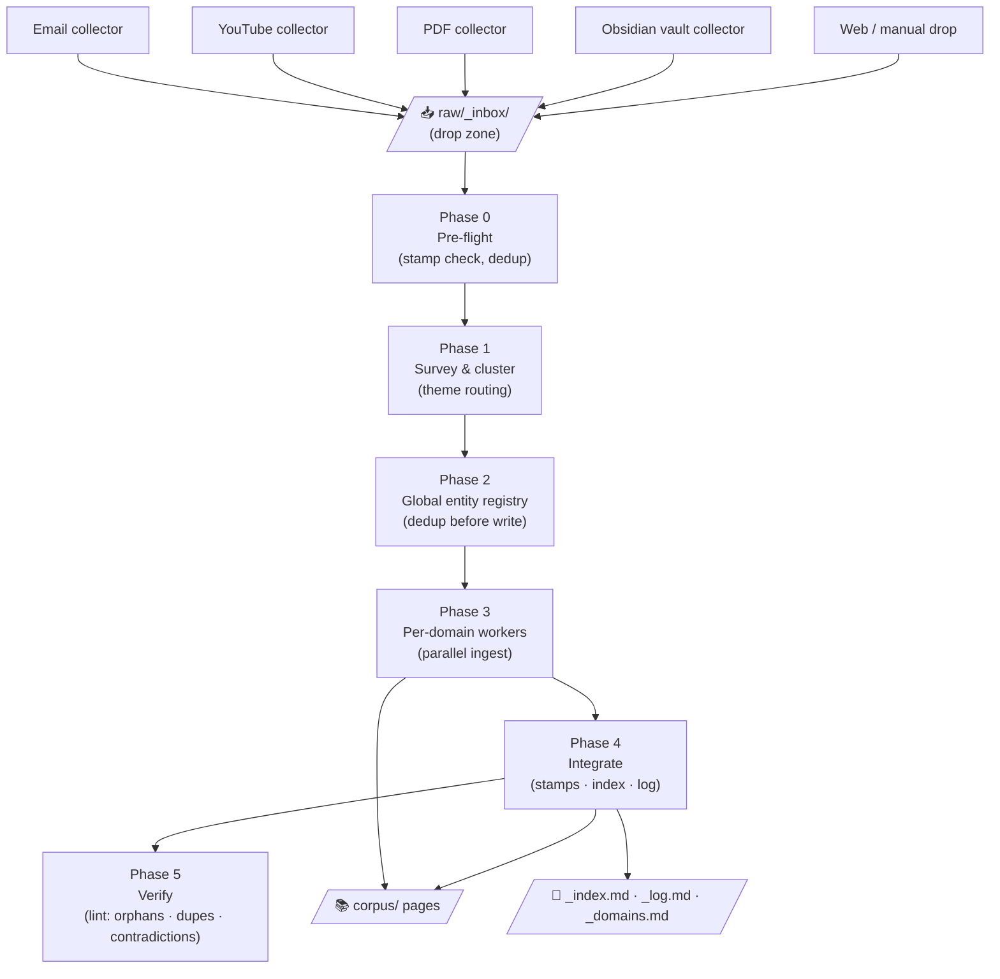

# How It Works

The pipeline has five stages: **collect → inbox → cluster & route → ingest → verify**. Each stage has a clear owner and a clear output. The agent runs the whole arc autonomously; the only thing the maintainer provides is sources.



---

## Stage 0 — Collection

[Collectors](collectors.md) are lightweight harvesters, one per intake channel. They run on a schedule and deposit source files into a single drop zone: `raw/_inbox/`. Each file arrives with enough metadata (title, URL or channel, date, tags) for the agent to route it without reading the full body.

Collectors are idempotent. A source that's already been deposited — identified by URL or content hash — is silently skipped. Nothing reaches the inbox twice.

---

## Stage 1 — Pre-flight and survey

Before reading any source body, the agent runs a pre-flight check:

1. **Stamp check.** Has this source already been processed? Every ingested source carries a `corpus_ingested: true` flag in its frontmatter. If the flag is present, the source is skipped by default (the maintainer can force a re-ingest, but it's never automatic).

2. **Survey pass.** The agent reads a condensed record per source — title, tags, first paragraph — without loading full bodies. This is fast and cheap.

3. **Clustering.** Sources are grouped by theme in a single pass. The cluster map is resolved against the active domain list (`_domains.md`). Most clusters route to an existing domain. A cluster that doesn't fit any existing domain — and contains at least three sources — may trigger a new domain proposal. Clusters too small for a domain become pages within the nearest existing one.

!!! note "Anti-drift by design"
    The domain rules are conservative: it's always cheaper to route a source into an existing domain than to create a new one. New domains require evidence (at minimum three sources that genuinely don't fit anywhere else) and are marked provisional until they grow. Lint reviews provisional domains at 30 days.

---

## Stage 2 — Global entity registry

This is the step that prevents duplicate pages.

Before a single page is written, the agent extracts candidate entities and concepts from all sources across all clusters — and deduplicates them globally. It reconciles candidates against the existing index (by name and alias similarity) and against each other, producing a registry:

```
{ canonical-slug → aliases, domain, existing-page-path-or-null }
```

A concept that appears under three different names in three different sources gets one page. An entity that already exists in the corpus gets an update, not a twin. The registry is the single source of truth for all writes in Phase 3.

This global dedup step is what makes parallel per-domain workers safe: each worker gets a pre-computed registry and writes only to its own domain's pages. There's no race to create the same entity twice.

---

## Stage 3 — Per-domain ingest (parallel)

With the cluster map and entity registry in hand, per-domain workers run in parallel. Each worker owns exactly one domain and handles a disjoint set of source files and pages. Workers never write to shared files (`_index.md`, `_log.md`, `_domains.md`) — that's the coordinator's job.

Per worker, for each source:

1. **Read the full body.** Highlights (from Matter exports), timestamps (from YouTube transcripts), and structured sections are all treated as higher-signal than prose summaries.
2. **Create or update pages** using the registry. Each extracted claim gets an inline citation before the page is written — claims without a citable source are marked `[unsourced — please verify]` or omitted.
3. **Link new pages from the domain hub.** Every new page is referenced from its domain's `README.md`. Orphan pages — no inbound hub link — are not permitted.
4. **Write a source-summary page** when the source is substantive enough to warrant standalone treatment.

!!! tip "Contradiction detection happens here"
    If a new claim conflicts with an existing page, the worker doesn't silently pick the newer version. It flags the conflict and either updates with explicit supersession markup or creates a `synthesis` page naming the disagreement. History stays auditable.

A well-calibrated ingest run for a medium-sized source typically touches 10–15 pages: a mix of new stubs, enriched existing pages, and one or two source-summary pages.

---

## Stage 4 — Integration

Workers return structured deltas; the coordinator serializes them. In order:

- **Source stamps.** Each processed source file gets three frontmatter fields added: `corpus_ingested: true`, `corpus_ingested_at: <date>`, and `corpus_pages: [list]`. No other changes to source files are permitted.
- **Index update.** `corpus/_index.md` is updated once from all worker deltas. The index is the catalog — it lists every page by domain, type, status, and one-line summary.
- **Log append.** An entry is appended to `corpus/_log.md` for each source processed: path, channel, domain, pages touched, new pages, and one line of notes. The log is append-only and chronological.
- **Inbox move.** Sources that arrived via `raw/_inbox/` are moved to their appropriate `raw/<channel>/` subfolder.

---

## Stage 5 — Verify (lint)

Every ingest run ends with a scoped lint pass over the domains that were touched. The lint checks, in order:

| Check | Action |
|---|---|
| Orphan pages | Link from hub or flag for archive |
| Stubs older than 14 days | Flag for expansion or archive |
| Duplicate entities (alias overlap) | Propose merge |
| Contradictions between pages | Create or update a synthesis page |
| Implicit concepts (referenced in 3+ pages, no own page) | Propose creation |
| Stale claims (newer source contradicts older) | Update with citation |
| Domain health (<3 pages after 30+ days) | Propose consolidation |
| Provisional domains (>30 days, <3 sources) | Propose merge or removal |

Safe fixes (linking an orphan, adding a forward reference) are applied automatically. Structural changes (merges, splits, new domains) are surfaced to the maintainer.

---

## The immutable-raw / derived-corpus split

The architecture enforces a hard boundary:

- **`raw/`** is read-only to the agent. Source files are never edited (only stamped with the three allowed fields). If the corpus were lost, it could be regenerated from `raw/`.
- **`corpus/`** is fully owned by the agent. No other tool writes here without coordination.

This separation has a practical consequence: **the stamp is the idempotency key**. Once a source carries `corpus_ingested: true`, the pre-flight check skips it. Re-ingest requires an explicit flag. Double-processing is structurally prevented, not just hoped for.

**Next:** [Collectors](collectors.md) — how sources reach the inbox from five different channels.
