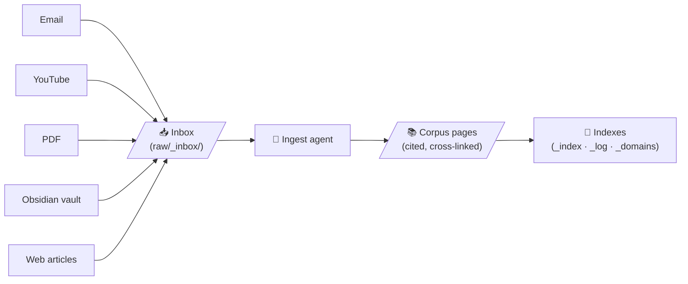

# A knowledge base that tends itself.

**Sources in. Cited pages out.**

**{{ corpus_stats().pages }}** pages · **{{ corpus_stats().sources }}** sources · **{{ corpus_stats().domains }}** domains

---

Most personal knowledge bases decay. Notes pile up, links rot, and the insights you captured last year become ghosts — present in the file system, invisible in practice. Corpus is built on a different premise: the LLM agent is the librarian. It reads every source, extracts what matters, and writes it into a self-organizing web of cross-linked, citable pages — then keeps that web consistent as new sources arrive.

The result compounds. Each new source enriches the pages that are already there. Each query can surface what the corpus knows *and* identify what it doesn't — automatically queuing the gap for the next ingest run.

Every arrow is automated. Every corpus page cites its sources. Every source is stamped once it's processed — so nothing gets ingested twice.

---

## The corpus, mapped

Each dot is a page; the larger nodes are the eight domain **hubs**, and the lines are the **citations and cross-links** between pages. This map is **generated from the live corpus on every commit** — it grows as the corpus does.

Drag to explore · hover a node for its title · {{ corpus_stats().pages }} pages · {{ corpus_stats().domains }} domains · {{ corpus_stats().sources }} sources.

---

-   :material-lightbulb-outline: **The Idea**

    ---

    Why a self-tending knowledge base beats a folder of notes — and why provenance is the one non-negotiable.

    [Read more](the-idea.md)

-   :material-pipe: **How It Works**

    ---

    The end-to-end pipeline: collect → inbox → cluster → ingest → verify. How sources become cited pages.

    [Read more](how-it-works.md)

-   :material-antenna: **Collectors**

    ---

    Five intake channels — email, YouTube, PDF, Obsidian vault, and web — each with its own harvesting logic.

    [Read more](collectors.md)

-   :material-robot-outline: **The Custodian**

    ---

    The autonomous agent runtime: ingest, lint, adapt, and eventually dream. How the corpus tends itself overnight.

    [Read more](the-custodian.md)

-   :material-wrench-outline: **Under the Hood**

    ---

    Schema, frontmatter spec, domain rules, the op log, and the operating manual (CLAUDE.md) that governs it all.

    [Read more](under-the-hood.md)

---

## Why this exists

Information that isn't cited can't be audited. Information that isn't cross-linked can't be found. And information that lives only in a chat history vanishes the moment the session ends.

Corpus treats every source as raw material. The agent's job is not to answer questions — it's to build a durable, searchable, linkable layer of derived knowledge that *can* answer questions, today and years from now. It's a compounding asset, not a conversation log.

!!! quote "Design principle"
    "Without provenance, the corpus becomes lossy compression you can't audit."

The whole system is governed by a single co-evolved operating manual that specifies path isolation, page types, ingest steps, lint checks, and anti-drift rules. The agent runs autonomously within those rules; the maintainer co-evolves the rules over time.

**Next:** [The Idea](the-idea.md) — the philosophy behind a self-organizing knowledge base.
