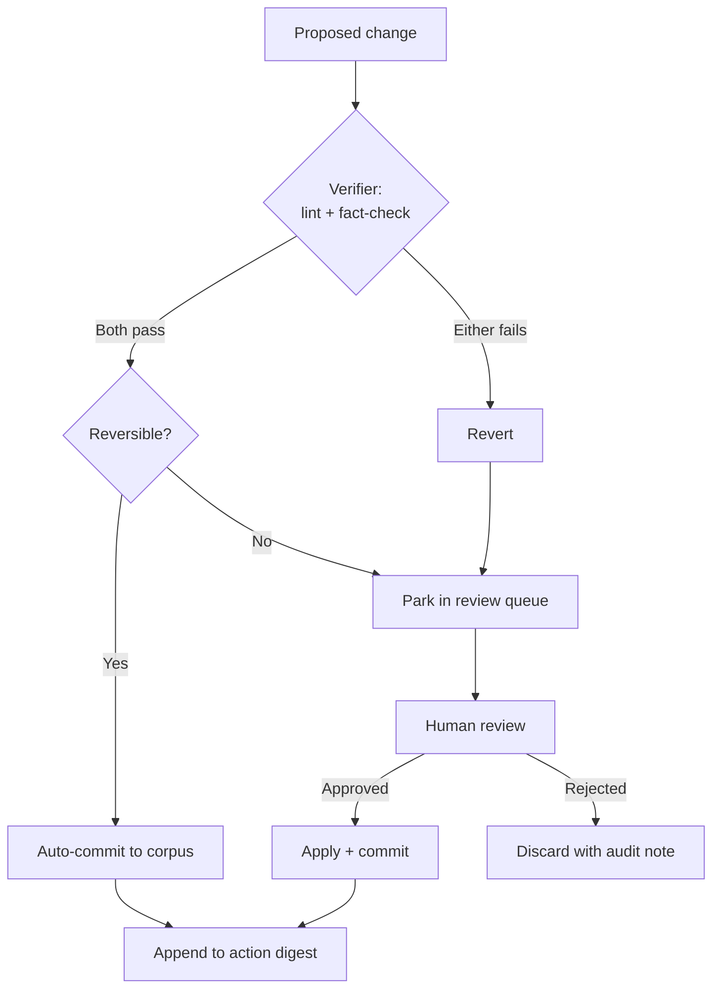

# The Custodian

A personal knowledge base is only as useful as the effort you're willing to keep putting into it. Most systems decay the moment life gets busy — stubs stay stubs, cross-references drift, half-ingested sources accumulate without ever becoming something you can actually query. The Custodian is the answer to that decay: an autonomous runtime that keeps the corpus in good shape without requiring continuous human attention.

The ambition has three axes:

- **Continuous-iteration loops** — the corpus is never "done"; the Gardener tends it round the clock, filling thin pages, fixing integrity issues, and surfacing what's drifted out of date.
- **Adaptive workflows** — the pipeline adjusts mid-run based on what it finds: routing harder cases to a stronger model, scaling out workers for large batches, escalating when uncertainty is too high to act alone.
- **"Dreaming"** — during quiet periods, the system consolidates what it knows, draws connections across domains, and proposes structural improvements — the way a human expert might synthesize overnight what they learned during the day.

!!! quote "The core design principle"
    Generated content is **never** trusted blindly. Every proposed change passes through a verifier before it can commit, and anything that doesn't clear the bar is reverted and queued for human review. The corpus's integrity is non-negotiable.

---

## Four data layers

The Custodian operates across a stack of four distinct layers, each with different trust levels and different rules about what can be written to them.

| Layer | Contents | Trust / mutability |
|---|---|---|
| **L0 — Raw** | Immutable source files as collected | Read-only; never modified after initial write |
| **L1 — Corpus** | The cited, cross-linked knowledge pages | High trust; written by ingest, maintained by Gardener; every change auditable |
| **L2 — Learned** | Meta-synthesis pages + an agent-owned heuristics store | Derived, non-authoritative; proposed by the Dreamer, promoted only on human sign-off |
| **Audit** | A review queue + a digest of every action taken | Append-only; the full history of what the system did and why |

The separation is deliberate. L0 being immutable means every corpus claim can always be traced back to an original source. L2 being non-authoritative means the system can speculate and synthesize without contaminating the vetted knowledge in L1. The audit layer means nothing is silent — every action the Custodian takes is recorded, reviewable, and reversible.

---

## One harness, three modes

The Custodian isn't a single monolithic agent — it's a shared safety harness that three distinct operating modes plug into. The harness enforces the governance rules; the modes each have their own purpose and rhythm.

### The Gardener — continuous corpus tending

The Gardener runs on a loop, finding thin or stale pages and improving them. Its job is straightforward in description and surprisingly subtle in execution: take a `stub` page, read the sources it cites, and expand it into a fully-cited `draft` that would satisfy the provenance rules in the operating manual.

The clever part is the *dual-model critic pattern*. The writer — running on a strong model — produces the improved page. An independent fact-checker — running on a cheaper model — then reviews it against the original sources. The critic is a **distinct process**, not a self-review, which means it actually catches the writer's mistakes rather than rubber-stamping its own output.

!!! abstract "Why a separate critic matters"
    A model asked to review its own output tends to rationalize rather than challenge. By running the critic on a different, cheaper model with no shared context from the writer's session, you get genuine adversarial pressure at low marginal cost.

The critic is **fail-closed**: the Gardener only auto-commits a change when *both* the lint check and the fact-check pass. If either fails, the proposed change is reverted and the page is placed in the human review queue with a note explaining what the critic objected to.

**In its first real run against the corpus, the Gardener filled 6 of 8 eligible thin pages.** The fact-checker correctly blocked the remaining two — catching a misattributed quote that the writer had confidently placed under the wrong source, an over-claim that went meaningfully beyond what the cited text actually said, and a broken cross-reference that would have orphaned a page. Nothing fabricated reached the corpus.

### Adaptive Ingest — dynamic fan-out with escalation

Standard ingest handles the routine case well: a batch of sources arrives, they're clustered by domain, workers run in parallel, the coordinator integrates the results. But real batches aren't uniform — some sources are dense and multi-domain, some are ambiguous to route, some produce so many candidate pages they warrant a sanity check before being committed.

Adaptive Ingest adds a control layer on top of the base pipeline:

- **Dynamic fan-out**: worker count scales with batch size and source heterogeneity rather than being fixed.
- **Model escalation**: when a worker encounters a source it's uncertain about — ambiguous routing, conflicting claims, complex multi-entity extraction — it escalates to a stronger model for that source only. The rest of the batch continues uninterrupted.
- **Completeness critic**: after integration, a critic pass checks whether the page count is plausible given the sources processed. A batch of 20 substantive sources that produces 3 pages is suspicious; the critic flags it rather than letting the coordinator close the run.

### The Dreamer — idle consolidation

The Dreamer runs during quiet periods, after the nightly collect-and-ingest cycle is complete and no active tasks are pending. Its purpose is synthesis: finding connections across domains that routine ingest misses because each worker only sees its own cluster.

The Dreamer can propose:

- **Cross-domain synthesis pages** — when the same concept appears independently in multiple domains, a synthesis page that links them adds navigational value the individual pages can't provide alone.
- **Structural improvements** — reorganization suggestions, domain merges, or splits when the corpus has grown enough that the current shape no longer serves it.
- **Heuristic refinements** — observed patterns in what the Gardener's fact-checker blocks most often, what routing decisions cluster together, what page shapes seem to get the most cross-links. These go into the L2 heuristics store as candidates, not into L1.

Everything the Dreamer produces lands in the review queue first. Proposed pages are labelled as Dreamer-generated; structural suggestions are formatted as proposals with explicit rationale. Learned heuristics only graduate from L2 into the operating manual with explicit human sign-off. The Dreamer speculates productively; it doesn't decide.

---

## Tiered governance

The governance model is the Custodian's most important feature. Every proposed change — whether from the Gardener, Adaptive Ingest, or the Dreamer — passes through the same decision gate before anything reaches the corpus.

The key properties this enforces:

- **Verifier first, always.** No change commits without passing lint and fact-check. The verifier has no memory of the change that produced the proposal; it evaluates the output on its own merits.
- **Reversibility gates auto-commit.** Even a change that passes verification must be reversible to auto-commit. A new page or an expansion of an existing page is reversible (git revert restores the prior state). A domain merge or a page deletion is not — those always go to the review queue regardless of how cleanly they pass verification.
- **Review queue is the safe default.** When in doubt, park it. The queue is visible; the corpus is protected.

---

## Safety, grounded in real lessons

Autonomous agents are powerful and, when something goes wrong, expensive. The Custodian's safety model is grounded in concrete failure modes — some observed in the wild, some avoided by design.

**Hard iteration caps.** Every mode has a maximum number of pages it may touch in a single run. A run that hits the cap stops, commits what it has, and logs a warning rather than continuing indefinitely.

**Wall-clock limits.** Independent of page count, each run has a maximum wall-clock duration. Long-running background processes have a way of quietly compounding their impact; the clock kills them before that becomes a problem.

**Loop detection by fingerprint.** Before each iteration, the Gardener hashes the set of pages it's considering and compares it to the previous iteration's hash. If the set hasn't changed — if it's going in circles, re-evaluating the same pages without making progress — the run stops immediately.

!!! warning "Why loop detection matters"
    Unbounded agent loops are a real failure mode. An agent that repeatedly tries and fails to make progress doesn't stop on its own — it keeps consuming resources until something external interrupts it. The fingerprint check makes "no progress" an explicit termination condition rather than an implicit assumption.

**Main-branch-only commits.** The Custodian commits only to the main branch, verified at the point of commit (not just at run start — a time-of-check / time-of-use race once caused an early version to commit to a feature branch). Pre-commit re-verification closes that gap.

**Immutable raw layer.** L0 is never written by the Custodian. Sources, once collected, are permanent records. The corpus can always be rebuilt from them.

**Action digest.** Every change the Custodian makes — every page written, every commit staged, every item parked in the review queue — is appended to the action digest in the audit layer. Nothing is silent. A human can always open the digest and understand exactly what the system did and why.

---

## The vision: loop → adapt → dream

The Gardener is in production. Adaptive Ingest handles nightly batch runs. The Dreamer is the next frontier.

Together, they describe a trajectory: a knowledge base that doesn't require you to tend it every day, that gets richer on its own as sources accumulate, that surfaces connections you wouldn't have noticed manually, and that does all of this without ever silently changing things you'd want to review.

The operating manual — the schema, the routing rules, the provenance discipline — remains human-owned. Learned heuristics that the Dreamer discovers can *propose* amendments, but they graduate into the manual only with explicit sign-off. The system gets smarter; the human stays in control of what "smart" means.

!!! tip "The north star"
    A knowledge base you can trust is more valuable than a knowledge base that's merely large. Every design decision in the Custodian — the dual-model critic, the fail-closed verifier, the review queue, the loop detector — is in service of that trust.

---

**Next:** [Under the Hood](under-the-hood.md) — the technical architecture behind collectors, ingest, and the Custodian runtime.
